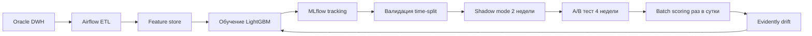

# Флоу работы

> Заполнено по [шаблону](../../template/flow.md). TODO: уточнить детали.

## 1. Сбор данных
TODO: источники, объём.

## 2. EDA
TODO: ключевые находки.

## 3. Feature engineering
TODO: поведенческие агрегаты, платёжная активность, обращения в поддержку.

## 4. Обучение
- **Baseline:** логрегрессия на 15 фичах.
- **Финал:** LightGBM, ~TODO фичей.

## 5. Валидация
- **Схема:** time-based split.
- **Метрика:** ROC-AUC TODO.

## 6. A/B-тест
TODO: длительность, размер выборки.

## 7. Деплой
Batch-скоринг раз в сутки через Airflow, результат складывается в витрину для retention-команды.

## 8. Мониторинг
Evidently + Grafana. Retraining — раз в 2 недели.
