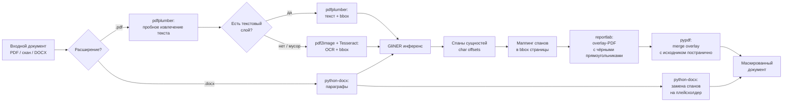

# Флоу работы

Сервис устроен как end-to-end пайплайн: на вход — исходный документ (PDF текстовый / PDF-скан / DOCX), на выход — визуально идентичный документ с замаскированными ПДн.

## Схема пайплайна

## 1. Обучение модели (офлайн-этап)

### 1.1. Сбор обучающих данных через синтетику
Реальные документы с ПДн выносить нельзя → решение: **синтетика**.

- Отобрали ~10–20 типовых шаблонов документов (договоры, отчёты, приложения).
- Через **self-hosted LLM** (внутри контура) генерировали тексты по этим шаблонам с подстановкой реалистичных фейковых ФИО, ИНН, адресов, номеров счетов и т.п. LLM использовалась именно для вариативности формулировок, а значения полей генерились алгоритмически — чтобы ground-truth метки сущностей были известны точно.
- Добавили **открытые русскоязычные NER-датасеты** (Nerel, Collection3 и подобные) для устойчивости модели к общим именным сущностям.
- Итого: **~10–30 тыс. обучающих документов** с разметкой спанов.

### 1.2. Дообучение GliNER
- **Базовая модель:** предобученный GliNER (универсальный zero/few-shot NER на трансформере), веса заранее скачаны и перенесены в контур артефактом.
- **Fine-tune:** на собранной синтетике + open-data, классические шаги для token-classification через HuggingFace Transformers + PyTorch.
- **Валидация:** hold-out из синтетики + небольшой набор внутренних документов, размеченных руками внутри контура.
- **Метрики:** Recall — как главный целевой показатель (нельзя пропускать ПДн), F1 — как контрольная.

## 2. Инференс (онлайн)

### 2.1. Определение типа документа (скан или текстовый PDF)

PDF-файл формально не говорит о себе «я скан» или «я текстовый» — это определяется по содержимому. Логика такая:

1. **По расширению** сразу отсеиваем DOCX в отдельную ветку.
2. Для PDF открываем файл через `pdfplumber` и **пробуем извлечь текст** постранично: `page.extract_text()` + `page.extract_words()`.
3. **Эвристика скан vs текст, постранично:**
   - если `extract_words()` возвращает достаточно слов (выше порога — например, ≥ N слов или ≥ M символов на страницу) → считаем страницу **текстовой**;
   - если текст пустой или почти пустой → **скан** (нет текстового слоя);
   - дополнительная проверка: если символов много, но **доля «мусора»** (непечатаемые символы, странные Unicode-блоки, подозрительная доля не-кириллицы/не-латиницы в русскоязычном документе) выше порога — считаем страницу «псевдо-текстовой» и всё равно гоним через OCR, иначе NER получит мусорный вход и просадит recall.
4. Решение принимается **на уровне страницы**, а не файла целиком: в одном PDF может быть, скажем, 3 текстовые страницы + 2 скана (фотокопии подписанных приложений). Для смешанных документов разные страницы идут по разным веткам.

Зачем такая проверка: главная метрика — **recall**, и тихо пропустить ПДн из-за того, что «мы думали это текстовый PDF, а там на самом деле мусор из битого OCR-слоя», недопустимо. Лучше лишний раз пустить страницу через OCR.

### 2.2. Парсинг документа
- **PDF с нормальным текстовым слоем:** `pdfplumber` вытаскивает слова со страничными координатами (x0, y0, x1, y1), текст собирается построчно.
- **PDF-скан (или страница с битым текстом):** `pdf2image` рендерит страницу в картинку → `pytesseract` (Tesseract) даёт текст + bbox для каждого слова. Для плохих сканов перед OCR делается препроцессинг через Pillow (deskew, бинаризация, удаление шума).
- **DOCX:** `python-docx` проходит по параграфам и runs.

### 2.3. Распознавание сущностей
Склеенный текст документа подаётся в дообученный **GliNER**. На выход — список спанов `(start, end, label)` в символьных координатах.

### 2.4. Маппинг спанов в координаты страницы
Между символьными offset'ами в склеенном тексте и bbox слов на страницах хранится соответствие (построенное на этапе парсинга). Каждый спан сущности проецируется в один или несколько bbox на конкретной странице.

### 2.5. Генерация маскированного PDF
- Для каждой страницы исходного PDF создаётся **overlay-страница** в `reportlab`: на пустом canvas той же размерности рисуются **чёрные прямоугольники** по координатам bbox сущностей.
- Через `pypdf` overlay-страница **сливается** с соответствующей страницей исходного PDF (`page.merge_page(overlay_page)`). Это работает единообразно и для текстовых PDF, и для отсканированных — прямоугольники просто закрашивают нужные места поверх исходного содержимого.
- На текстовых PDF важный нюанс: overlay рисует поверх, но текстовый слой под прямоугольником формально остаётся. Для критичных документов (перед отдачей подрядчику) страница дополнительно может быть **растеризована** (pdf2image → img2pdf-сборка) — тогда текстовый слой полностью исчезает и ПДн нельзя достать `Ctrl+A`.

### 2.6. DOCX-ветка
Для Word-документов оверлей не нужен: `python-docx` напрямую заменяет спаны сущностей в текстах runs на плейсхолдер (например, `██████`), сохраняя форматирование.

## 3. Деплой и эксплуатация

- **Сервис:** FastAPI, упакован в Docker, запущен on-prem.
- **Контракт:** REST — `POST /mask` с файлом в теле, ответ — маскированный файл того же формата.
- **Нагрузка:** сотни документов в день, синхронная обработка укладывается в SLA.
- **Логи:** никаких фрагментов исходного текста в логи не пишется (как раз чтобы не загрязнять инфраструктуру ПДн).
