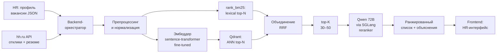

# Флоу работы

Сервис работает как **двухступенчатый ранжировщик**: сначала быстрая гибридная кандидатогенерация (BM25 + dense в Qdrant), потом медленный, но точный LLM-reranker (Qwen 72B через SGLang) на top-K.

## Схема пайплайна

## 1. Офлайн-этапы

### 1.1. Дообучение эмбеддера под HR-домен
База — русскоязычный sentence-transformer (открытые веса, скачаны заранее и перенесены в контур). Дообучаем через contrastive loss на парах:

- **Позитивы:** `(описание вакансии, резюме реально нанятого кандидата)` — взяты из исторических наймов компании.
- **Позитивы (синтетика):** `(вакансия, резюме)` — дополнительные пары, сгенерированные self-hosted LLM, с разметкой «сильный матч».
- **Негативы (hard-negative mining):** для каждой пары подбираются резюме с высоким BM25/дефолтным dense-score, но явно не подходящие под вакансию по ключевым полям (грейд, стек).

Дообученный эмбеддер сохраняется артефактом, из него потом считаем векторы для вакансий и резюме.

### 1.2. Индексация резюме
- Для каждого нового резюме, прилетевшего через hh.ru API, считается эмбеддинг и кладётся в **Qdrant** (с payload'ом: ID отклика, ID вакансии, краткие поля резюме).
- Резюме также токенизируются и попадают в **in-process BM25-индекс** (`rank_bm25`) — на уровне сервиса.

### 1.3. Разметка для offline-оценки
- Исторический hold-out: по каждой закрытой вакансии известно, кого в итоге наняли / пригласили на интервью → это сигнал релевантности.
- Плюс небольшой набор вакансий, где HR руками проставил релевантность по топу выдачи, — для более честной оценки.

## 2. Online-пайплайн (обработка одной вакансии)

### 2.1. Получение откликов из hh.ru
Backend через официальный **employer-API hh.ru** пулит отклики на вакансию и содержимое резюме. Данные нормализуются: извлекаются опыт, навыки, образование, зарплатные ожидания. Учитываются rate limits — запросы кэшируются и ретраятся с бэкоффом.

### 2.2. Гибридная кандидатогенерация

**Ветка A — BM25 (rank_bm25).**
Из структурированного профиля вакансии собирается «bag-of-skills» и ключевые фразы. По этому запросу rank_bm25 даёт топ-N резюме по лексическому совпадению. Это ловит буквальные совпадения навыков («Airflow», «LightGBM», «Python»), которых эмбеддинги иногда недооценивают.

**Ветка B — dense (Qdrant).**
Структурированный профиль вакансии сериализуется в текст (специальный шаблон: «Роль: X. Грейд: Y. Стек: Z. Обязательно: …»). Этот текст прогоняется через дообученный эмбеддер → вектор → поиск ближайших в Qdrant → топ-N резюме по смыслу.

**Объединение.**
Списки BM25 и Qdrant сливаются через **Reciprocal Rank Fusion (RRF)** — простой и устойчивый способ объединить два рейтинга без подбора весов. На выходе — единый список кандидатов, обрезаемый до **top-K = 30–50**.

### 2.3. LLM-reranker: Qwen 72B через SGLang
Для каждого из top-K кандидатов формируется запрос к **Qwen 72B, развёрнутому на SGLang**:

- в промпте — структурированный профиль вакансии и ключевые поля резюме;
- модель возвращает **численный score** (например, 0–10) и **короткое объяснение** в 1–2 предложения («Подходит: 7 лет Python + опыт в финтехе; не хватает: опыт с Airflow»).

Запросы к SGLang идут батчем, чтобы амортизировать latency. Top-K выбран именно такой (30–50) как компромисс между качеством reranker'а и временем отклика сервиса.

Почему **72B, а не 7B/14B/32B**: на парах вакансия↔резюме меньшие модели давали шумные и плохо согласованные скоры (одну и ту же пару могли ранжировать по-разному при небольших перефразировках). 72B даёт заметно более стабильное ранжирование и адекватные объяснения — цена в виде latency амортизируется через ограничение top-K и батчинг SGLang.

### 2.4. Финальный список и UI
Отсортированный по LLM-score список, дополненный объяснениями, уходит в **frontend**. HR видит:

- топ кандидатов с числовым score;
- короткое объяснение от reranker'а («почему этот кандидат на этом месте»);
- фильтры (по грейду, зарплате, опыту);
- возможность оставить свой лейбл для будущего дообучения.

## 3. Обратная связь
Лейблы HR (подходит / не подходит / уже пригласили на интервью) складываются в хранилище → используются как дополнительный сигнал для следующей итерации дообучения эмбеддера и для мониторинга качества.
