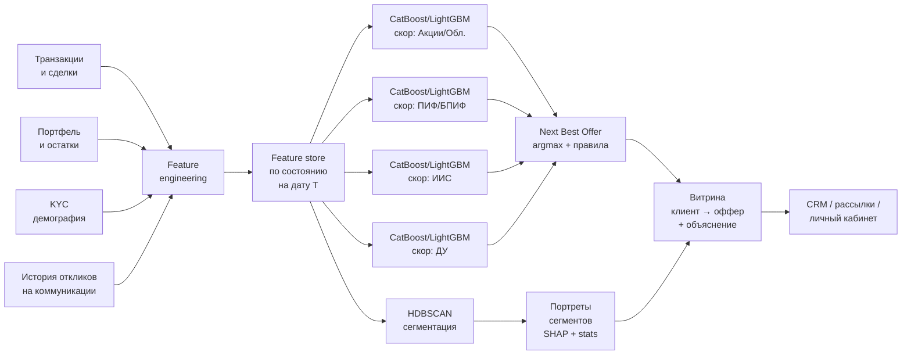

# Флоу работы

Система устроена как двухчастный пайплайн: **unsupervised сегментация** HDBSCAN даёт «портрет» клиента и контекст для маркетинга, а **supervised скоринг** по каждому продукту принимает фактическое решение о Next Best Offer. Работает в двух режимах — ночной batch и realtime-досчёт по событиям.

## Общая схема

## 1. Сбор и подготовка данных

### 1.1. Источники
- **Транзакции и сделки** — из торговой системы / DWH.
- **Портфель и остатки** — snapshot'ы по состоянию на дату.
- **KYC / анкета** — из клиентского профиля.
- **История откликов** — логи email/push/CRM-звонков с метками «кликнул / купил / отказался».

### 1.2. Feature engineering
Ключевые группы фичей:
- **Поведенческие** (по транзакциям): частота сделок, средний чек, доля покупок/продаж, активность по классам активов, сезонность.
- **Портфельные**: AUM, диверсификация, доля в каждом классе активов, динамика стоимости портфеля.
- **KYC**: возраст, стаж на рынке, риск-профиль, регион, доход.
- **Отклики**: историческая конверсия по каналам, отклик на похожие продукты в прошлом.

Все фичи считаются **на дату среза T** — никакой информации из будущего относительно T в них нет. Это важно для избежания target leakage (см. [ретро](retro.md)).

### 1.3. Feature store
Витрина с зафиксированной датой «на момент». Одна запись = `(client_id, date, features…)`. Используется и для обучения (исторические среды), и для онлайн-скоринга.

## 2. HDBSCAN сегментация

### 2.1. Почему HDBSCAN, а не KMeans
- **Клиентская база неоднородна по плотности:** есть плотные «ядра» (активные клиенты одного типа) и разреженные редкие паттерны.
- **Сегменты не сферические** — KMeans на них даёт бессмысленные центроиды.
- **HDBSCAN явно выделяет шум** (клиенты, которых нельзя отнести ни к одному кластеру — новички, одноразовые, нерегулярные). Их не нужно насильно засовывать в какой-то сегмент.

### 2.2. Что делается
- Нормализация фичей, снижение размерности (UMAP опционально) → HDBSCAN.
- На выходе — `segment_id` для каждого клиента (или `-1` для «шумовых»).
- **Портрет сегмента** генерируется автоматически: top-фичи сегмента по описательным статистикам + глобальные SHAP-важности от supervised-модели.

## 3. Supervised скоринг на Next Best Offer

### 3.1. Модели
Отдельные **бустинги (CatBoost/LightGBM)** под каждый продукт:
- скор покупки акций/облигаций,
- скор покупки ПИФ/БПИФ,
- скор открытия/пополнения ИИС,
- скор перехода в ДУ.

Каждая модель предсказывает вероятность отклика клиента на этот конкретный продукт в ближайшем окне (например, 30 дней).

### 3.2. Данные и разметка
- **Positive:** клиент купил/откликнулся в целевом окне после среза T.
- **Negative:** клиент не откликнулся в том же окне.
- **Time-aware split:** train — до даты T₁, validation — T₁..T₂, test — после T₂.

### 3.3. Борьба с дисбалансом
Отклик — редкое событие. Используются `scale_pos_weight` / `class_weight`, аккуратный undersampling мажоритарного класса, и главное — **PR-AUC** как дополнительная метрика помимо ROC-AUC (ROC-AUC на сильном дисбалансе оптимистична).

### 3.4. Next Best Offer — argmax + бизнес-правила
Для каждого клиента получаем вектор скоров `[score_stocks, score_pif, score_iis, score_du]`. NBA выбирается так:

1. **Argmax по вектору** — кандидат-оффер с максимальным скором.
2. **Бизнес-правила поверх:**
   - риск-профиль клиента должен соответствовать продукту;
   - KYC/комплаенс-ограничения (квалифицированный инвестор для части продуктов);
   - стоп-листы маркетинга (клиент уже получил оффер на той же неделе, клиент отписан от канала);
   - исключение продуктов, которые клиент уже имеет.
3. Если top-1 оффер не проходит правила — берём top-2 и т.д.

## 4. Режимы работы в проде

### 4.1. Batch (ночной)
- **Airflow DAG** запускается ночью.
- Пересчитываются фичи по всем клиентам на дату T, считается сегментация HDBSCAN, считаются скоры по всем продуктам, вычисляется NBA, результат пишется в витрину `client → offer + explanation`.
- Витрина забирается CRM и маркетингом для утренних рассылок/обзвонов.

### 4.2. Realtime-досчёт при ключевых событиях
Некоторые события не могут ждать ночного пересчёта: их нужно обрабатывать сразу, потому что они сильно меняют контекст клиента и часто сами по себе — «окно возможности» для оффера.

Триггерные события:
- **пополнение счёта** на значимую сумму;
- **первая покупка бумаги** у нового клиента;
- **изменение риск-профиля** в анкете;
- **крупный вывод средств** (триггер для retention-оффера).

На такое событие realtime-ветка:
1. Подтягивает актуальные данные клиента.
2. Пересчитывает его фичи «на момент».
3. Прогоняет только его через скоринг-модели (один клиент, не вся база).
4. Обновляет его запись в витрине NBA.

Это позволяет CRM среагировать в течение минут, а не ждать ночи.

## 5. Мониторинг и A/B-тесты

- **Качество модели** — drift по ключевым фичам и скорам через MLflow/Evidently.
- **Бизнес-эффект** — A/B-тест: тестовая группа получает коммуникации по NBA, контрольная — по старой логике. Продуктовый аналитик меряет CTR, конверсию и uplift.
- **Retrain** — раз в период (или по триггеру drift'а), с включением свежих откликов в обучающую выборку.
