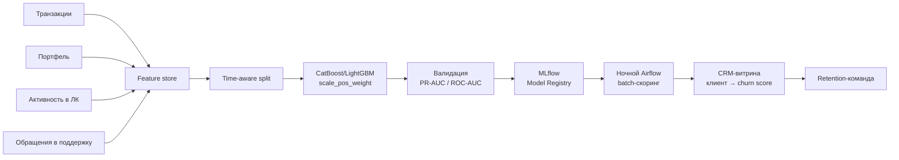

# Флоу работы

## Схема

## Постановка задачи

- **Таргет:** `1` — клиент в течение ближайших 30–90 дней перестал торговать или закрыл счёт; `0` — остаётся активным.
- **Горизонт:** 30, 60, 90 дней — отдельные таргеты / отдельные модели под разные сроки реакции retention-команды.
- **Метрика:** PR-AUC (из-за сильного дисбаланса — отток редкое событие), ROC-AUC как контрольная.

## Данные и фичи

- **Транзакции и сделки:** частота операций, средний чек, динамика активности (например, «было 20 сделок в месяц, стало 2»).
- **Портфель:** AUM, диверсификация, доля cash, вывод средств за последние 30/60/90 дней.
- **Поведение в ЛК:** частота входов, последний визит, клики по ключевым разделам.
- **Обращения в поддержку:** количество тикетов, тональность последних обращений, тематики (особенно «хочу закрыть счёт», «не устраивает комиссия»).
- **KYC/стаж:** возраст, стаж на рынке, риск-профиль.

Все фичи считаются «на дату среза T» через тот же feature store, что и в кейсе 04 (NBA).

## Обучение и валидация

- **Split:** строго time-aware — train до даты T₁, validation T₁..T₂, test после T₂. Никакого случайного перемешивания.
- **Дисбаланс:** `scale_pos_weight` в LightGBM / `class_weights` в CatBoost, PR-AUC как primary metric.
- **Бейзлайн:** простое правило «нет сделок за 30 дней» — чтобы видеть, насколько ML выигрывает у эвристики.
- **Интерпретация:** SHAP — для retention-команды генерируется короткое объяснение «почему клиент под риск» (например: «резко упала частота сделок, вывод 40% портфеля, 2 обращения про комиссии»).

## Деплой

- **Ночной Airflow DAG** пересчитывает фичи → читает модель из MLflow Model Registry → прогоняет всю клиентскую базу → пишет `client_id → churn_score → explanation` в CRM-витрину.
- **Retention-команда** утром получает отсортированный список клиентов «под риск» с объяснением и работает по нему сверху вниз.
- **Retrain:** периодический, с включением свежих меток оттока.
