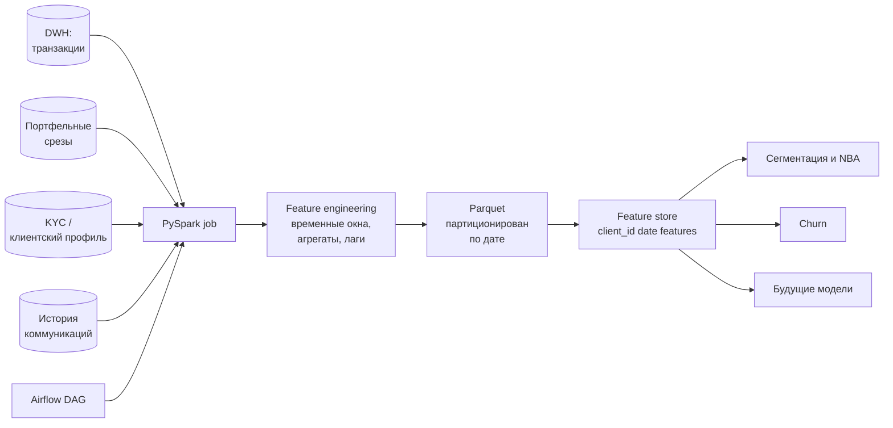

# Флоу работы

## Схема

## Проблема, которую решали

До feature store каждая команда/модель собирала клиентские фичи **по-своему**: pandas-скрипты, SQL в ноутбуках, ручные выгрузки. Это приводило к:

- **Расхождениям:** одна и та же фича («AUM клиента на дату T») считалась по-разному в разных моделях.
- **Медленному пересчёту:** pandas-ETL на миллионах транзакций упирался в память и работал часами.
- **Отсутствию воспроизводимости:** невозможно было честно повторить фичу «на исторический момент» — фичи считались «как сейчас».

Нужен был один источник истины + промышленный ETL.

## Архитектура PySpark-джобы

### 1. Чтение источников
- **Транзакции** — из DWH через JDBC-коннектор или выгрузку в Parquet.
- **Портфельные срезы** — исторические snapshot'ы, уже в Parquet.
- **KYC / клиентский профиль** — маленькие, но важные; читаются отдельно и **broadcast-джоинятся** с крупными таблицами.
- **История коммуникаций** — логи email/push/CRM с метками отклика.

### 2. Feature engineering
Фичи по логически связанным группам:
- **Поведенческие:** частота сделок, средний чек, динамика активности (30/60/90-дневные окна).
- **Портфельные:** AUM, диверсификация по классам активов, доля cash, динамика.
- **KYC:** демография, стаж, риск-профиль.
- **Коммуникации:** CTR, отклик на прошлые офферы.

Все оконные агрегаты — через Spark Window-функции с **time-aware фильтрацией** (фичи на дату T используют только данные до T — это критично для избежания target leakage в обучении моделей).

### 3. Оптимизации

- **Партиционирование по дате** в выходном Parquet → модели читают только нужные даты.
- **Broadcast join** для маленьких справочников (инструменты, KYC) → уходит дорогой shuffle.
- **Repartition перед джоинами** больших таблиц по ключу клиента → равномерная нагрузка на экзекьюторы.
- **Salt'инг** для skewed-ключей (VIP-клиенты с огромным количеством транзакций).
- **Кэширование** промежуточных DataFrame'ов, которые используются в нескольких веток расчёта.

### 4. Запись
- Формат: **Parquet** с снэппи-компрессией.
- Партиционирование: по `date` (и, возможно, по хэш-бакету `client_id` для балансировки).
- Схема фиксирована и версионируется.

## Оркестрация и тесты

- **Airflow DAG** запускается ночью, параметризуется датой среза, триггерит PySpark-джобу через `SparkSubmitOperator`.
- Дополнительные задачи DAG'а: проверка свежести источников, валидация схемы выходного Parquet, алерты при падении.
- **Юнит-тесты** на преобразования — через `pytest + pyspark.testing` или `chispa`, на маленьких sample-датафреймах. Проверяется корректность агрегатов, time-aware логики, поведение на граничных случаях.
