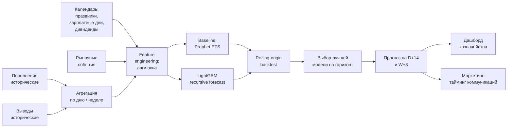

# Флоу работы

## Схема

## Постановка задачи

Две связанные задачи:

1. **Дневной горизонт (D+1..D+14).** Для операционки и казначейства — сколько средств приходит и уходит в ближайшие две недели. Точность важна по каждому дню.
2. **Недельный горизонт (W+1..W+8).** Для более долгосрочного планирования — тренды и сезонность, меньше реакция на ежедневный шум.

Таргеты:
- **Приток** (дневной/недельный объём пополнений),
- **Отток** (дневной/недельный объём выводов),
- (опционально) **нетто** = приток − отток, как отдельный таргет.

## Данные

- **Исторические пополнения и выводы** — из DWH, по всей клиентской базе.
- **Календарь:**
  - праздники РФ, предпраздничные короткие дни, перенос выходных;
  - зарплатные дни (типичные даты начисления);
  - налоговые даты, дивидендные отсечки по популярным бумагам;
  - экспирации срочного рынка.
- **Рыночные события:** индексы волатильности (RVI/VIX), ключевые ставки ЦБ, крупные движения индексов.
- **Внутренние маркетинговые события:** крупные рассылки и кампании — как экзогенная переменная (рассылка → всплеск пополнений).

## Фичи

- **Лаги таргета:** t−1, t−7, t−14, t−28.
- **Скользящие средние и std** (3, 7, 14, 30 дней).
- **Календарные признаки:** день недели, день месяца, флаги рабочего/выходного, флаги зарплатного окна, дней до/после праздника.
- **Сезонные гармоники:** sin/cos на неделю и год (для ML-модели, чтобы явно выдать сезонность как признак).
- **Внешние сигналы:** волатильность, маркетинговые кампании, флаги дивидендных дней.

## Модели

### Baseline — Prophet / ETS
- **Prophet** быстро даёт приличный baseline с недельной и годовой сезонностью + кастомные holidays.
- **ETS (statsmodels)** — классический экспоненциальный сглаживающий baseline, хорош как sanity check.
- Используются как нижняя планка качества и как ансамбль-компонент.

### Основная — LightGBM с лагами
- Формулируется как **регрессия на табличных фичах**, где среди фичей — лаги таргета, скользящие статистики, календарь, экзогенные сигналы.
- **Recursive / direct forecasting** в зависимости от горизонта:
  - на короткие горизонты (1–3 дня) — direct multi-step;
  - на длинные (до 14 дней / 8 недель) — recursive с подстановкой предсказаний на роль будущих лагов.
- Плюсы перед Prophet: лучше ловит экзогенные эффекты (маркетинг, волатильность), можно использовать категориальные фичи и нелинейные взаимодействия.

### Ансамбль
На бэктесте проверяем простое усреднение Prophet + LightGBM — часто даёт более устойчивый прогноз, чем любая из моделей в одиночку.

## Валидация — rolling-origin backtest

**Никакого random split'а** — time series не прощают.

- Выбирается окно обучения (например, 2–3 года).
- Модель обучается до даты T, прогнозируется горизонт H, метрики считаются против фактов.
- Дата T сдвигается вперёд (на день/неделю), процедура повторяется.
- Агрегированные метрики (MAPE, MAE, RMSE) по всем роллинг-окнам дают честную оценку в продакшне.

Дополнительно — смотрим **ошибку по типам дней** (рабочие vs выходные, зарплатные vs обычные), чтобы видеть, где модель систематически промахивается.

## Деплой

- **Airflow DAG** запускает переобучение и построение прогноза раз в сутки.
- Прогнозы пишутся в таблицу `(date, horizon, target, forecast, lower, upper)`.
- Из этой таблицы питается **дашборд казначейства** (Grafana/Superset) + экспорт для планирования маркетинговых активностей.
