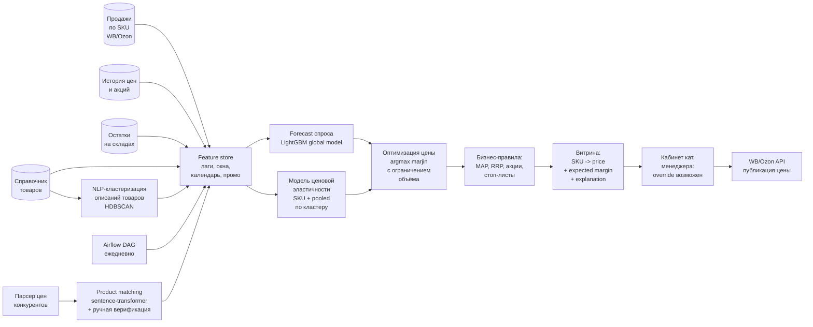

# Флоу работы

Система устроена как **трёхчастный ML-пайплайн**: сначала forecast спроса «при текущей цене», потом оценка ценовой эластичности, потом оптимизация цены с ограничением на объём. Поверх — слой бизнес-правил и ежедневный batch в Airflow.

## Схема

## 1. Данные и feature engineering

### 1.1. Источники
- **Продажи** по дням и SKU из выгрузок кабинетов WB/Ozon.
- **История цен и акций** — как менялся ценник и когда товар был в промо маркетплейса.
- **Остатки** на складах — для маски out-of-stock периодов.
- **Справочник товаров** — категория, бренд, атрибуты, описание, изображения.
- **Цены конкурентов** — собираются нашим парсером и матчатся к SKU клиента (см. раздел 3).

### 1.2. Ключевые фичи
- **Лаги и окна:** лаги продаж (t−1, t−7, t−14, t−28), скользящие mean/std, тренды.
- **Календарь:** день недели, флаги выходных, праздники, зарплатные недели, сезонные гармоники.
- **Промо-флаги:** участие SKU в акции WB/Ozon (да/нет + тип акции).
- **Цена:** текущая цена SKU, **отклонение от собственной скользящей средней**, **отклонение от цены конкурентов** (через product matching).
- **Остатки:** флаг in-stock / out-of-stock, дней до вероятного out-of-stock.
- **Категорийные:** SKU-ID, бренд, категория, NLP-кластер описания (см. раздел 4).

### 1.3. Маскирование out-of-stock
Любой день с нулевым остатком по SKU **исключается** из обучения — и при построении forecast'а, и при оценке эластичности. Иначе «нет продаж» ошибочно учится как «нет спроса».

## 2. Forecast спроса (LightGBM global model)

### 2.1. Архитектура
**Одна global-модель** LightGBM, обученная на всех SKU сразу, с `sku_id` как категориальной фичей. Почему так, а не «отдельная модель на каждый SKU»:

- **Объём данных:** отдельные модели на редких SKU переобучаются.
- **Перенос знаний:** global-модель учится закономерностям категории/бренда, которые помогают похожим SKU (включая новые).
- **Удобство эксплуатации:** один артефакт, один inference-путь.

Prophet используется как **baseline** для отдельных стабильных SKU — как sanity check.

### 2.2. Таргет и горизонт
- **Таргет:** дневные продажи в штуках по SKU.
- **Горизонт:** несколько дней вперёд (тактический шаг под переоценку цен) — достаточен, чтобы каждое утро принять решение «какую цену ставим на сегодня».

### 2.3. Валидация — rolling-origin backtest
- **Никакого random split'а.**
- Сдвигаемся по времени, каждый раз обучаемся до T, прогнозируем горизонт H, считаем MAPE/MAE.
- Метрики агрегируются глобально и по категориям — это видно в деталях по Achievements.

## 3. Модель ценовой эластичности

### 3.1. Суть
Forecast предсказывает спрос **при текущей цене**. Чтобы рекомендовать цену, нужно уметь отвечать на вопрос: «а если цена изменится на Δ%, как изменится спрос?» — это и есть ценовая эластичность.

### 3.2. Как учим
- Берём историю по SKU: пары `(цена_на_день, спрос_на_день)`.
- **Исключаем промо-периоды** — в промо спрос скачет не из-за нашей цены, а из-за механики маркетплейса, это портит оценку эластичности.
- **Исключаем out-of-stock** — см. выше.
- Оцениваем эластичность через регрессию `log(demand) ~ log(price)` + контроли (день недели, сезонность, волатильность категории).

### 3.3. Pooled-эластичность (cold-start и малая вариация)
Для SKU, где:
- мало наблюдений (новый товар),
- цена почти не менялась (нечего оценивать),

берём **pooled-оценку по NLP-кластеру** (см. раздел 4): товары с похожими описаниями обычно ведут себя похоже по эластичности. Эта оценка используется как приор; по мере накопления собственной истории SKU переходит на свою оценку.

## 4. NLP-подсистема

### 4.1. Кластеризация товаров по описаниям
- Берём русскоязычный **sentence-transformer** (open weights), считаем эмбеддинги для `название + описание` каждого SKU.
- Кластеризуем (HDBSCAN внутри категории, или KMeans для больших однородных категорий).
- **Используется для двух вещей:**
  1. **Pooled-эластичность** (см. раздел 3.3) — у схожих товаров похожая кривая спроса.
  2. **Cold-start новых SKU** — новый товар прогоняется через эмбеддер, попадает в кластер, модель эластичности и forecast получают приоры из кластера.

### 4.2. Product matching с конкурентами
- Parser (backend Webbee) собирает товары конкурентов с WB/Ozon и внешних магазинов.
- Для каждого SKU клиента ищем **матчи** среди товаров конкурентов через сходство эмбеддингов `название + описание` (cosine similarity).
- Для топовых SKU (по выручке) — **ручная верификация матчей** категорийным менеджером, чтобы убрать ложные срабатывания.
- Цена конкурентов и сам факт наличия у конкурентов идут в **forecast** и в **оптимизацию** как фичи — не как hard-constraint «всегда матчим», а как сигнал.

## 5. Оптимизация цены

Для каждого SKU ежедневно:

1. **Дискретная сетка цен** вокруг текущей (например, ±20% с шагом в пару процентов).
2. **Для каждой цены сетки:**
   - Прогнозируем спрос: forecast-модель даёт baseline при текущей цене, модель эластичности корректирует его под целевую цену.
   - Считаем ожидаемую маржу: `(price − cost) × expected_demand`.
3. **Выбираем argmax маржи** по сетке.
4. **Проверяем жёсткое ограничение:** ожидаемый объём в штуках должен быть `≥ (1 − α) × baseline_demand`. Если argmax нарушает — берём следующий лучший вариант, удовлетворяющий ограничению.
5. **Применяем слой бизнес-правил:**
   - минимальная цена (MAP/RRP по бренду),
   - стоп-листы (не трогать имиджевые SKU),
   - фиксированные цены на SKU в акции маркетплейса,
   - ограничения «не изменять цену чаще чем раз в N дней»,
   - исключения для новых SKU (безопасный cold-start режим).

**Объяснение** для категорийного менеджера формируется автоматически на основе ключевых факторов решения: «рекомендуем −5%, ожидаемый прирост спроса +12% при падении маржи per unit 4% → суммарный рост маржи +7%; цены конкурентов в среднем на 3% ниже текущей».

## 6. Эксплуатация

### 6.1. Batch в Airflow
- **DAG** запускается каждое утро.
- Этапы: обновление feature store → пересчёт forecast и эластичности → оптимизация цен → применение бизнес-правил → запись витрины `sku_id → recommended_price → expected_margin → explanation`.

### 6.2. Публикация цен
- **Backend Webbee** читает витрину и пушит новые цены в WB/Ozon через API селлеров с учётом rate limits и модерации.
- Цены применяются с задержкой платформы (учитывается в логике).

### 6.3. UI категорийного менеджера и override
- Менеджер видит список SKU с рекомендациями и объяснениями.
- Может принять всё автоматически, точечно править или отклонять рекомендации.
- Каждый override копится и используется для:
  - мониторинга (если менеджер часто отклоняет — сигнал о проблеме с моделью),
  - дальнейшего дообучения.

### 6.4. Бэктест и A/B-тест
- **Бэктест на истории:** реконструкция рекомендаций модели на прошлых периодах и сравнение с фактическими ценами клиента — оценка *потенциального* прироста маржи.
- **A/B-тест по SKU:** случайно разделённые группы SKU, одна под управлением модели, другая на старой логике; сравниваем маржу и объём в динамике, считаем **uplift по марже**.
