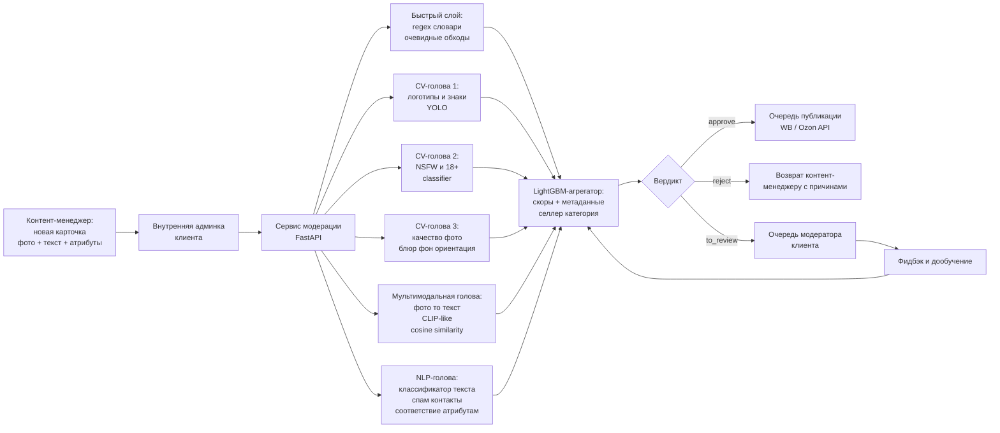

# Флоу работы

Архитектура — **многоголовая система** с параллельным запуском специализированных моделей и агрегатором поверх. Карточка одновременно уходит во все головы, каждая голова выдаёт свои флаги и скоры, LightGBM-агрегатор сводит это в финальный вердикт.

## Схема

## 1. Вход и быстрый слой

### 1.1. Вход
Карточка поступает из внутренней админки клиента: 1–N фото, название, описание, список атрибутов (категория, бренд, размеры, материалы), метаданные (какой контент-менеджер завёл, от какого поставщика).

### 1.2. Быстрый слой — regex и словари
Первым делом карточка проходит через дешёвые эвристики:
- **Regex на контакты:** телефоны, email, ссылки, telegram/whatsapp-упоминания (включая словарь «творческих» обходов — «вотсап», «плюс семь…», цифры словами).
- **Словарь запрещённых фраз:** «пишите напрямую», «заказ в обход», ссылки на сторонние магазины.
- **Базовая проверка длины и формата** описания.

Если что-то явное найдено — **флаг идёт в агрегатор**. Быстрый слой не принимает решения сам, но даёт сильный сигнал и покрывает очевидные случаи за миллисекунды, не нагружая тяжёлые модели.

## 2. CV-головы

Все CV-головы работают **параллельно** на одном и том же наборе фото карточки.

### 2.1. Детектор логотипов и водяных знаков
- **Базовая модель:** дообученный **YOLO-family детектор** на открытых датасетах логотипов (LogoDet-3K и подобные).
- **Доборка:** на истории отклонений клиента — собираем фото с реально пойманными чужими логотипами/знаками.
- **Аугментации:** искусственное наложение водяных знаков конкурентов на чистые фото клиента, разными стилями и прозрачностью, чтобы модель научилась ловить слабые сигналы.
- **Выход:** список найденных логотипов с bbox и уверенностью.

### 2.2. NSFW / запрещённый контент
- **База:** opensource NSFW-классификатор (что-то из семейства OpenNSFW / NudeNet).
- **Порог** выставлен **консервативно в сторону recall** — лучше отправить в `to_review`, чем пропустить.
- **Выход:** вероятности по классам плюс бинарный флаг.

### 2.3. Качество фото
- **Блюр:** классика CV — вариация Лапласиана, порог подобран по истории отклонений.
- **Фон, ориентация, мусор:** небольшой CNN, обученный на размеченных примерах.
- **Выход:** флаги `blurred`, `wrong_orientation`, `bad_background`, `too_small_resolution` + скоры.

## 3. Мультимодальная голова: соответствие фото ↔ текст

Самая нетривиальная проверка. Задача: проверить, что на фото действительно то, что заявлено в карточке.

- **Базовая модель:** CLIP-подобный мультимодальный энкодер (русскоязычная модель или пара image-encoder + text-encoder из открытых весов).
- **Доменный fine-tune:** на парах `фото ↔ название + ключевые атрибуты` из **истории одобренных карточек клиента** — так модель подтягивает специфику категорий клиента.
- **Как используется:**
    1. Считаем эмбеддинг главного фото.
    2. Считаем эмбеддинг текста `название + категория + ключевые атрибуты`.
    3. Берём **cosine similarity**.
    4. Порог — **калибруется по категориям** (одежда, электроника, косметика — у всех свой нормальный уровень похожести).
    5. Низкая похожесть → сильный сигнал «фото не соответствует описанию» → в агрегатор, почти всегда уходит в `to_review`.

Эта голова **не выносит решения сама** — слишком дорого ошибиться. Она даёт сильный сигнал, а финальный вердикт определяет агрегатор.

## 4. NLP-голова: классификация текста

- **Sentence-transformer / классификатор на BERT**, дообученный на разметке модераторов клиента в нескольких бинарных/многоклассовых задачах:
  - «спам / нерелевантное / нормальное» описание,
  - «есть попытка обхода контактов / нет»,
  - «соответствие атрибутам / противоречие».
- **Проверка соответствия атрибутам** (отдельная подзадача): из атрибутов карточки (например, `размер=42`, `материал=хлопок`) формируется ожидание, NLP-классификатор смотрит, нет ли в описании явных противоречий.
- **Выход:** вектор скоров и флагов.

## 5. LightGBM-агрегатор

Всё сходится в агрегаторе:

- **Фичи агрегатора:**
    - Скоры и флаги всех CV-голов.
    - Cosine similarity фото ↔ текст.
    - Скоры и флаги NLP-головы.
    - Флаги быстрого слоя (regex, словари).
    - **Метаданные карточки:** категория, бренд, поставщик (от какой фабрики пришла), селлер/контент-менеджер, история отклонений по этому поставщику.
- **Таргет:** вердикт из истории модераторов клиента (`approve` / `reject` / + причина).
- **Модель:** **LightGBM** с `class_weight` под redall-фокус на `reject`.
- **Выход:** три скора — `p(approve)`, `p(reject)`, `p(to_review)`, — и финальный вердикт по порогам.

### Почему агрегатор, а не «просто OR всех флагов»
- Разные проверки имеют разную надёжность — у одной высокая precision, у другой шумная. LightGBM учится правильно их взвешивать на реальной разметке.
- Метаданные (категория, поставщик) сильно меняют интерпретацию: «такой флаг на электронике — почти всегда reject; на одежде — часто false positive».
- Проще калибровать пороги и объяснять решения.

## 6. Вердикт и три ветки

### 6.1. `approve`
Карточка автоматически уходит в очередь публикации — backend Webbee пушит её в WB/Ozon через API селлера.

### 6.2. `reject`
Карточка **возвращается контент-менеджеру** с **причинами** — какие проверки и почему её завернули. Контент-менеджер видит конкретные пункты («найден логотип другого бренда на фото 2», «в описании телефон +7...», «фото не соответствует категории») и исправляет.

### 6.3. `to_review`
**Очередь модератора клиента.** Модератор смотрит карточку и флаги от моделей, принимает финальное решение, отмечает причины. Эти решения используются как новые обучающие примеры (см. раздел 7).

### 6.4. Консервативный fallback
Если **хоть одна** голова выдаёт высокий скор на «опасном» классе (запрещённый контент, риск бана) — вердикт **форсированно** `to_review` (или `reject`), даже если агрегатор был склонен к `approve`. Это explicit safety layer для recall-critical проверок.

## 7. Обратная связь и дообучение

- Все вердикты модераторов на `to_review`-очереди складываются в хранилище как **размеченные примеры**.
- Ошибки агрегатора (когда модератор переопределил решение модели) идут в приоритетную выборку для анализа и дообучения.
- Регулярный **retrain** агрегатора на новой разметке.
- Словари regex-слоя и чёрные списки поставщиков **обновляются auto-mining'ом** новых паттернов из свежих отклонений.

## 8. Производительность

- **Параллельный запуск** всех голов — узкое место определяется самой медленной головой, а не суммой.
- **Кэширование эмбеддингов** фото по хэшу — если контент-менеджер перезалил то же фото, заново CV не гоняем.
- **Каскадность:** для очевидных кейсов (найден явный запрещённый контент быстрым слоем) можно короткозамкнуть пайплайн, не дожидаясь тяжёлых моделей, — но это делается только для `reject`, не для `approve`.
