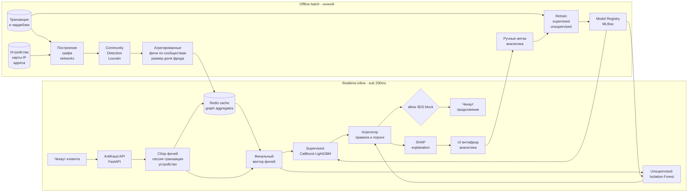

# Флоу работы

Система разделена на **два контура**: быстрый **realtime inline** (вызывается из чекаута, десятки миллисекунд SLA) и медленный **offline batch** (раз в сутки — пересчёт графа, community detection, обновление фичей, retrain моделей). Realtime читает уже готовые графовые агрегаты из кэша — считать граф на каждый запрос слишком дорого.

## Схема



## 1. Realtime inline поток

### 1.1. Вызов из чекаута
Бэкенд клиента на этапе подтверждения платежа дёргает `/score` нашего сервиса с payload'ом:

- клиент (ID, email, телефон, history summary);
- корзина (сумма, состав, категория товаров);
- платёж (токенизированная карта, BIN, страна эмитента, 3DS-статус);
- сессия (device fingerprint, IP, user-agent, поведение до оплаты);
- метаданные доставки (адрес, получатель).

### 1.2. Сбор фичей
Сервис формирует итоговый вектор фичей, комбинируя **три источника**:

1. **Фичи из самой транзакции** (считаются на лету из payload'а): сумма, mismatch биллинг/shipping, возраст аккаунта, скорость ввода форм.
2. **История клиента/карты/устройства** — читается из хранилища (Postgres/DWH) по ключам клиент-ID / device-ID / карт-ID.
3. **Графовые агрегаты** — читаются из **Redis cache** по тем же ключам: `community_id`, размер community, **доля чарджбэков в community за последние 30/60/90 дней**, плотность связей узла, количество аккаунтов за устройством и т.п.

Redis — ключевое место: без него графовые фичи не успеют считаться inline.

### 1.3. Скоринг — параллельно supervised и unsupervised

**Supervised (CatBoost/LightGBM):**
- обучена на исторических парах `транзакция → chargeback / ручной_фрод_вердикт`;
- выход — вероятность фрода `p_fraud ∈ [0, 1]`.

**Unsupervised (Isolation Forest):**
- обучена на «нормальном» распределении фичей;
- выход — аномальный скор `anomaly_score`;
- нужна, чтобы ловить **новые схемы**, которых ещё нет в истории chargeback'ов.

Оба скора считаются параллельно, каждый занимает миллисекунды после того, как фичи уже собраны.

### 1.4. Агрегация и правила поверх

Агрегатор комбинирует:

- `p_fraud` (главный сигнал, вес высокий);
- `anomaly_score` (дополнительный сигнал, поднимает общий скор при высоких аномалиях);
- **жёсткие графовые флаги** — например, если устройство клиента уже в «фрод-коммьюнити» с > N подтверждёнными chargeback'ами за последние 60 дней, транзакция форсированно идёт в `3DS` или `block` независимо от supervised-скора;
- **белый список** (VIP, клиенты с длинной историей без проблем) — снижает склонность к `block`;
- **чёрный список** (устройства/карты с уже подтверждённым фродом) — форсированный `block`.

### 1.5. Три исхода

- **`allow`** — транзакция идёт к эквайеру как обычно.
- **`3DS challenge`** — клиент отправляется на 3D Secure. Это **мягкая мера** для сомнительных кейсов: честный клиент пройдёт, мошенник скорее всего отвалится. Используется как дефолт для серой зоны.
- **`block`** — жёсткая блокировка. Используется только при **высокой уверенности** модели **+ подтверждающих графовых сигналах** (например, устройство в фрод-community). На front'е клиент получает «попробуйте другую карту», запись уходит в очередь ручного разбора аналитика.

### 1.6. Объяснения для антифрод-аналитика
Параллельно с решением формируется **короткий текст причин** через SHAP: топ-фичи, внёсшие наибольший вклад в решение, переведённые на человеческий язык.

Пример: *«Блокировка: mismatch billing (DE) / shipping (RU), IP из high-risk сети, устройство фигурирует в community из 12 аккаунтов с 7 chargeback'ами за последние 30 дней, нестандартно быстрая скорость заполнения формы»*.

Это уходит в UI аналитика клиента и сохраняется как часть лога решения (важно для последующих споров с банком).

## 2. Offline batch поток

### 2.1. Построение графа

Из DWH ночью собирается **мульти-сущностный граф**:

- **Узлы:** клиенты, устройства (device fingerprint), карты (хэш), адреса доставки, email, IP.
- **Рёбра:** «использовались вместе в транзакции». Вес ребра — количество совместных появлений + веса по свежести.

Реализация через `networkx` (или `graph-tool` для больших графов) — клиентская база сотни тысяч узлов, это укладывается в оперативную память одной машины.

### 2.2. Community Detection — Louvain

На графе запускается **Louvain** (алгоритм модулярности) — выделяются плотно связанные сообщества узлов. Реальность такая, что мошеннические «кольца» обычно расшаривают карты/устройства/адреса между собой, и на графе они формируют явные community.

Для каждого community считаются **агрегированные метрики**:

- размер community (сколько узлов);
- **доля транзакций в chargeback** по history всех узлов community за 30/60/90 дней;
- число подтверждённых фрод-вердиктов в community;
- средняя сумма транзакций.

### 2.3. Кэширование в Redis

Для каждого узла (клиент / устройство / карта / IP) готовится агрегированная запись:

```
{
  "community_id": "...",
  "community_size": 42,
  "community_chargeback_rate_30d": 0.14,
  "community_fraud_count_60d": 7,
  "neighbor_accounts_count": 11,
  ...
}
```

и кладётся в **Redis** по ключу узла. Realtime-сервис читает эти записи за миллисекунды.

Актуальность графовых фичей — сутки, чего для фрод-сценария достаточно: Community Detection — медленно меняющаяся структура, и новые связи между узлами появляются постепенно.

### 2.4. Retrain supervised и unsupervised

- **Таргет:** история chargeback'ов + ручные вердикты аналитика.
- **Split:** строго **time-aware** (train до T₁, validation T₁..T₂, test после T₂) — никакого random split'а на time-sensitive задаче.
- **Chargeback delay:** таргет по чарджбэкам приходит с задержкой 30–90 дней, поэтому актуальные данные — немного «в прошлом». Для свежих транзакций используются ручные вердикты аналитика как прокси-сигнал (они появляются быстро).
- **Дисбаланс:** `scale_pos_weight` (или `class_weight`), undersampling мажоритарного класса **только в train**, валидация в натуральной пропорции, главная метрика — **PR-AUC**.
- **Unsupervised:** Isolation Forest переобучается на свежих данных, чтобы оставаться в актуальном «нормальном» распределении.
- **Регистрация моделей** — в MLflow Model Registry; realtime-сервис читает из registry.

### 2.5. Мониторинг drift'а и адверсариального поведения
- **Evidently** — drift по ключевым фичам и стабильность скоров.
- **Канал «новых паттернов»:** транзакции, которые Isolation Forest пометил как сильные аномалии, но supervised-модель пропустила, — приоритетно идут аналитику на ручной разбор. Результат ручного разбора попадает в следующий retrain.
