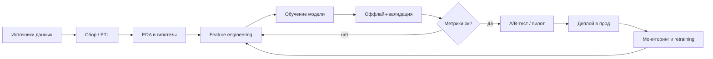

# Флоу работы

!!! note "Что писать"
    Стандартный end-to-end DS-пайплайн. Цель этого раздела — показать, что ты понимаешь **полный цикл**, а не только «обучил модель в ноутбуке». Описывай именно то, что было в проекте; если каких-то этапов не было — так и напиши.

## Схема пайплайна

## 1. Сбор и подготовка данных

- **Источники:** [DWH / продуктовые БД / логи / внешние API / разметка вручную]
- **Объём:** [~N млн строк / M признаков / T месяцев истории]
- **Как получали:** [SQL-выгрузки / Airflow DAG / стриминг из Kafka]
- **Качество:** [пропуски, дубли, как чистили]

<!-- подсказка: если ты сам писал ETL — обязательно упомяни -->

## 2. EDA и проверка гипотез

- [Какие гипотезы формулировали до моделирования?]
- [Что нашли в данных интересного / неожиданного?]

## 3. Feature engineering

- [Ключевые группы признаков: поведенческие, временные, агрегаты, эмбеддинги]
- [Были ли специфичные трюки: target encoding, time-aware split, и т.п.]

## 4. Обучение модели

- **Baseline:** [логрегрессия / константа по среднему — от чего отталкивались]
- **Итерации:** [какие модели пробовали и почему]
- **Финальный выбор:** [что поехало в прод и почему именно оно]

## 5. Оффлайн-валидация

- **Метрики:** [ROC-AUC / PR-AUC / RMSE / MAPE / NDCG — то, что реально мерили]
- **Схема валидации:** [time-based split / k-fold / hold-out]
- **Результаты:** [бейзлайн X → финал Y]

## 6. A/B-тест или пилот

- [Как катили: shadow mode → A/B → полный rollout]
- [Размер выборки, длительность]
- [Бизнес-метрика и её прирост]

## 7. Деплой

- **Режим:** [batch (раз в сутки/час) / realtime API / on-device]
- **Инфраструктура:** [Airflow + S3 / FastAPI + k8s / Spark job]
- **Как паковали модель:** [pickle / ONNX / MLflow Model Registry]

## 8. Мониторинг и переобучение

- **Что мониторили:** [качество модели, data drift, latency, нагрузка]
- **Где смотрели:** [Grafana / Evidently / custom dashboard]
- **Retraining:** [раз в неделю / по триггеру drift / руками]
